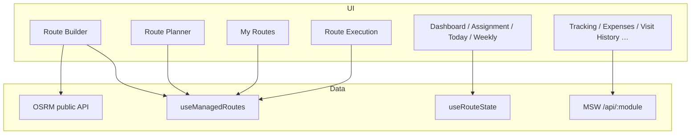

# Route Management Module

Documentation for the **Route Management** area of the RouteSale Web Portal — field sales route planning, assignment, map-based execution, tracking, collections, and related operations.

---

## 1. Overview

Route Management supports **field-based FMCG / distribution sales**. Planners create and assign geo-optimized delivery routes; drivers and salesmen execute stops in the field; managers monitor progress, visits, GPS, collections, and expenses.

**Demo geography:** Kozhikode / Malabar region (warehouses, customers, and corridors are seeded for that area).

| Capability | Description |
|------------|-------------|
| **Planning** | Build routes from start → end corridor; auto-pick customer stops; OSRM map polyline |
| **Assignment** | Assign drivers/vehicles; map staff to routes and outlets |
| **Scheduling** | Weekly templates and daily route generation |
| **Execution** | Driver “My Routes”, live stop progress, GPS / simulation, Google Maps nav |
| **Field day** | Interactive 13-step salesman day wizard (demo) |
| **Monitoring** | Dashboard KPIs, tracking, visit history, performance |
| **Financial ops** | Collections and field expenses in route context |

---

## 2. Architecture (important)

The module uses a **hybrid** setup:

1. **Standalone geo pages** — custom React pages under `src/pages/route/` with map (Leaflet), OSRM routing, and `useManagedRoutes`.
2. **Legacy assignment / schedule pages** — simpler salesman + delivery-agent model via `useRouteState`.
3. **Config-driven modules** — AG Grid / charts via `ModulePage` + `ModuleLayout` and MSW mock APIs.

There is **no production backend** for managed routes today. Data lives in **localStorage** (and MSW for generic modules). The public **OSRM** API is used for driving directions.

### Two data stores (not synced)

| Store | Hook | Storage key | Used by |
|-------|------|-------------|---------|
| Geo / managed routes | `useManagedRoutes` | `rs_managed_routes_v1` | Route Builder, Planner, My Routes, Execution |
| Legacy routes | `useRouteState` | `rs_routes`, `rs_schedules`, `rs_visits`, `rs_shops`, `rs_staff` | Dashboard, Add Route, Assignment, Today’s Routes, Weekly Schedule |

> Changes in the map workflow do **not** automatically appear in the legacy dashboard list, and vice versa.



---

## 3. Sidebar & URL paths

### Visible in sidebar (Route Management)

| Menu label | Path |
|------------|------|
| Dashboard | `/route-sales/dashboard` |
| Route Creation | `/route-sales/route-builder` |
| Route Planner (Map) | `/route-sales/route-planner` |
| My Routes (Driver) | `/route-sales/my-routes` |
| Outlet Registration | `/route-sales/outlet-registration` |
| Route Tracking | `/route-sales/route-tracking` |
| Expenses | `/route-sales/expenses` |

### Other reachable routes (not all shown in sidebar)

| Screen | Path | Notes |
|--------|------|-------|
| Field Day Flow | `/route-sales/field-day` | Role-guarded demo wizard |
| Add Route | `/route-sales/add-route` | Legacy create form |
| Route Assignment | `/route-sales/route-assignment` | Legacy staff ↔ route |
| Today's Routes | `/route-sales/todays-routes` | Legacy daily monitor |
| Weekly Schedule | `/route-sales/weekly-schedule` | Legacy templates |
| Route Execution | `/route-sales/my-routes/:routeId` | Opened from My Routes |
| Add Collection | `/route-sales/collections/new` | Collection form |
| Visit History | `/route-sales/visit-history` | Generic module |
| GPS Tracking | `/route-sales/gps-tracking` | Generic module |
| Route Performance | `/route-sales/route-performance` | Generic module |
| Attendance | `/route-sales/attendance` | Generic module |
| Customer Visits | `/route-sales/customer-visits` | Generic module |
| Collections | `/route-sales/collections` | Generic module |
| Route Sales Report | `/route-sales/route-sales-report` | Generic module |

**Quick action:** “Allocate Route” → `/route-sales/route-assignment`.

---

## 4. Pages & features

### 4.1 Route Dashboard — `/route-sales/dashboard`

- Overview KPIs and route cards (legacy `useRouteState`).
- Visit history tab; links toward planner / builder / field day.
- Good starting point for managers reviewing daily route activity.

### 4.2 Route Creation (Builder) — `/route-sales/route-builder`

**Roles:** `admin`, `manager`

1. Choose start and end points (warehouse / corridor).
2. Set corridor width (default ~3 km), vehicle, driver, delivery date.
3. System matches customers along the corridor (`customersAlongRoute`).
4. Fetches driving polyline via OSRM (falls back to haversine estimate).
5. Save → managed route with status `scheduled` (or draft until assigned).

**Save rules:** blocked if no stops, or start equals end. Name is optional (auto-generated from start → end + date).

### 4.3 Route Planner (Map) — `/route-sales/route-planner`

**Roles:** `admin`, `manager`

- List / filter managed routes.
- Map preview.
- Bulk assign driver; delete routes.
- Entry point after builder for day planning.

### 4.4 My Routes (Driver) — `/route-sales/my-routes`

**Roles:** `admin`, `manager`, `salesman`, `deliveryAgent`

- Date-filtered list of assigned routes.
- Field staff (`salesman` / `deliveryAgent`) only see routes where `driverId ===` logged-in user.
- Open a route → Route Execution.

### 4.5 Route Execution — `/route-sales/my-routes/:routeId`

**Roles:** `admin`, `manager`, `salesman`, `deliveryAgent`

- Start route → first stop becomes `in_progress`.
- Complete or skip stops; auto-advance to next pending stop.
- Map with real GPS (`useGeolocation`) or simulated movement along polyline.
- Open Google Maps navigation for a stop.
- Summary cards: distance, orders, sales, collections.
- Route becomes `completed` when all stops are completed or skipped.

### 4.6 Field Day Flow — `/route-sales/field-day`

**Roles:** `admin`, `manager`, `salesman`, `deliveryAgent`

Interactive **13-step** salesman day demo:

Start Day → GPS On → Visit Market → New Shop? → Check-In → Create Order → Invoice → Payment → Check-Out → End Route → Upload History → Route Learned → Suggestions.

UI demo only — does not persist into `useManagedRoutes`.

### 4.7 Legacy pages

| Page | Path | Purpose |
|------|------|---------|
| Add Route | `/route-sales/add-route` | Assign salesman + delivery agent to a named route |
| Route Assignment | `/route-sales/route-assignment` | Map staff to route names / outlets |
| Today's Routes | `/route-sales/todays-routes` | Daily route list + manual add |
| Weekly Schedule | `/route-sales/weekly-schedule` | Day templates; generate routes for a target date |

### 4.8 Supporting modules (config-driven)

| Module | Path | Purpose |
|--------|------|---------|
| Outlet Registration | `/route-sales/outlet-registration` | Register shops; optional approve flow |
| Visit History | `/route-sales/visit-history` | Historical visit log |
| Route Tracking | `/route-sales/route-tracking` | Mock live route / agent status map |
| GPS Tracking | `/route-sales/gps-tracking` | GPS position list |
| Route Performance | `/route-sales/route-performance` | Order performance per route |
| Attendance | `/route-sales/attendance` | Field attendance |
| Customer Visits | `/route-sales/customer-visits` | Per-customer visit records |
| Collections | `/route-sales/collections` | Payment collections (+ Add Collection) |
| Expenses | `/route-sales/expenses` | Fuel / travel / meals claims |
| Route Sales Report | `/route-sales/route-sales-report` | Route-wise sales summary |

---

## 5. Primary user workflows

### A. Map-based lifecycle (recommended)

```
Route Builder → save managed route
     ↓
Route Planner → assign driver / review map
     ↓
My Routes (driver, by date) → Open Route
     ↓
Route Execution → Start → Complete/Skip stops → Done
```

### B. Legacy schedule → daily routes

```
Weekly Schedule → define active days + staff/shops
     ↓
Generate routes for target date
     ↓
Today's Routes / Dashboard → monitor & add visits
```

### C. Collections

```
Route Sales → Collections → Add Collection
     → /route-sales/collections/new → save
```

---

## 6. Roles & permissions

| Role | Typical access |
|------|----------------|
| `admin` / `manager` | Builder, Planner, all driver pages, Field Day |
| `salesman` / `deliveryAgent` | My Routes, Execution, Field Day (own routes only on My Routes) |
| Any authenticated user | Legacy dashboard / assignment / today / weekly (no RoleGuard) |

Demo logins (see `src/mocks/flowData.ts`):

| Mobile | Name | Role |
|--------|------|------|
| `9876543210` | Rahul Sharma | salesman |
| `9876543211` | Amit Delivery | deliveryAgent |
| `9876543212` | Priya Manager | manager |
| `9876543213` | Admin User | admin |

---

## 7. Data models

### Managed route (geo) — `src/types/route.ts`

| Type | Key fields |
|------|------------|
| `ManagedRoute` | `id`, `code`, `name`, warehouse/vehicle/driver, `deliveryDate`, `status`, `stops[]`, distance/duration, `polyline`, `routingSource` |
| `RouteStop` | customer info, `sequence`, `status`, ETA, leg distance, `orderValue`, `collectionAmount` |
| `RouteProgressSummary` | stop counts, progress %, sales, collections, distance covered |

**Route statuses:** `draft` | `scheduled` | `in_progress` | `completed` | `cancelled`

**Stop statuses:** `pending` | `in_progress` | `completed` | `skipped`

### Legacy — `src/pages/route/routeState.ts`

| Type | Purpose |
|------|---------|
| `RouteItem` | Named route with salesman, delivery agent, outlets, visited, sales/collections |
| `WeeklySchedule` | Template: route name, days, staff/shop counts, `isActive` |
| `VisitRecord` | Visit log entry |
| `ShopItem` / `StaffItem` | Outlets and assignable staff |

---

## 8. Business rules

### Managed routes

- Completing/skipping a stop promotes the next **pending** stop to `in_progress` if none is in progress.
- Default collection on complete: ~`orderValue * 0.65` (unless overridden).
- Assigning a driver turns `draft` → `scheduled`.
- Route codes: `RTM-{n}` style generation.
- OSRM timeout ~7s → fallback straight-line estimate (`routingSource: 'estimate'`).

### Route Builder

- Cannot save with zero stops or identical start/end.
- Corridor matching uses seeded customers in `routeGeoData.ts`.

### Legacy

- Add route requires name, salesman, delivery agent.
- Adding a visit updates matching route `visited` / collections / sales.
- Weekly generate only uses **active** schedules whose days intersect selection; skips duplicate route name for that date.

---

## 9. APIs & services

### Client-side managed routes (`useManagedRoutes`)

| Action | Description |
|--------|-------------|
| `createRoute` | Create managed route |
| `updateRoute` / `deleteRoute` | Patch or remove |
| `assignDriver` | Bulk assign driver to routes |
| `reorderStops` | Update stop order + geometry |
| `updateStopStatus` | Complete / skip / progress |
| `startRoute` | Begin execution |
| `computeRouteProgress` | Progress summary helper |

### External routing

| Service | Usage |
|---------|--------|
| `https://router.project-osrm.org/route/v1/driving/...` | Driving polyline (`src/utils/osrm.ts`) |

### Mock flow API (`/api/v1/...`) — documented UI panels

| Method | Endpoint | Purpose |
|--------|----------|---------|
| GET/POST | `/api/v1/route-assignments` | Multi-assign staff + shops |
| GET | `/api/v1/routes/today` | Live route shop list |
| PATCH | `/api/v1/routes/shops/:shopId/visit` | Mark visited / skipped |
| GET/POST/DELETE | `/api/v1/routes/weekly-schedule` | Schedule templates |
| POST | `/api/v1/routes/weekly-schedule/generate-today` | Generate daily assignments |
| GET/POST/PATCH | `/api/v1/shop-requests` | Outlet registration approve flow |

### Generic module CRUD

`GET/POST/PUT/DELETE /api/{module-slug}` via `src/api/client.ts` (e.g. `route-sales-collections`, `route-sales-expenses`).

---

## 10. Source file map

### Pages — `src/pages/route/`

| File | Role |
|------|------|
| `RouteDashboardPage.tsx` | Dashboard |
| `RouteBuilderPage.tsx` | Route creation + map |
| `RoutePlannerPage.tsx` | Planner / assign / delete |
| `MyRoutesPage.tsx` | Driver route list |
| `RouteExecutionPage.tsx` | Live execution |
| `FieldDayFlowPage.tsx` | 13-step field day |
| `AddRoutePage.tsx` | Legacy add |
| `RouteAssignmentPage.tsx` | Legacy assignment |
| `TodayRoutePage.tsx` | Legacy today |
| `WeeklySchedulePage.tsx` | Legacy weekly |
| `RouteWorkflowStrip.tsx` | Step pipeline UI |
| `useManagedRoutes.ts` | Managed route store |
| `routeState.ts` | Legacy store + types |
| `routeGeoData.ts` | Seed warehouses, vehicles, drivers, customers |
| `routeCompute.ts` | OSRM helpers (available; not all wired) |

### Components — `src/components/route/`

| File | Role |
|------|------|
| `RouteMap.tsx` | Leaflet map |
| `RouteSummaryBar.tsx` | Distance / duration / stops bar |
| `DeliverySummaryCards.tsx` | Execution KPIs |
| `StopReorderList.tsx` | Drag-reorder stops (component exists) |
| `mapIcons.ts` | Marker icons |

### Routing & config

| File | Role |
|------|------|
| `src/routes/index.tsx` | React Router entries |
| `src/routes/navigation.ts` | Sidebar |
| `src/routes/RoleGuard.tsx` | Role checks |
| `src/config/modules.ts` | Generic module definitions |
| `src/types/route.ts` | Geo types |
| `src/utils/osrm.ts` / `src/utils/geo.ts` | Routing & geo math |

---

## 11. Integrations

| Area | How it connects |
|------|-----------------|
| **Customers** | Seed customers on map; outlet registration |
| **Collections** | Route collections list + `/collections/new` |
| **Sales** | Field day orders; `/sales/route-sales`; route performance |
| **Expenses** | Field expense claims under Route Management |
| **Logistics** | Vehicles / drivers in geo seed; vehicle & driver modules |
| **HR** | Route attendance; sales targets / incentives |
| **Dashboard** | `RoutePerformanceWidget` on home |
| **Auth** | Driver IDs align with demo user IDs |

---

## 12. LocalStorage keys

| Key | Content |
|-----|---------|
| `rs_managed_routes_v1` | `ManagedRoute[]` |
| `rs_routes` | Legacy `RouteItem[]` |
| `rs_schedules` | `WeeklySchedule[]` |
| `rs_visits` | `VisitRecord[]` |
| `rs_shops` | `ShopItem[]` |
| `rs_staff` | `StaffItem[]` |
| `route-sale-auth` | Auth session (Zustand) |

Clearing browser storage resets demo route data.

---

## 13. Developer notes

1. Prefer **managed routes** (`useManagedRoutes`) for new map / execution features.
2. Legacy and managed stores are **independent** — do not assume shared state.
3. Standalone pages for builder / planner / my-routes / dashboard **override** matching generic module paths in the router.
4. Production would replace localStorage + MSW with real REST APIs while keeping the same page flows.
5. Related high-level product docs also live in root `README.md` (§ Route Management) and `DEVELOPER.md`.

---

## 14. Quick reference — who does what

| Actor | Main screens |
|-------|----------------|
| Manager / Admin | Builder → Planner → Dashboard / Tracking / Reports |
| Driver / Salesman | My Routes → Execution (and optionally Field Day) |
| Back office | Outlet Registration, Collections, Expenses, Visit History |
