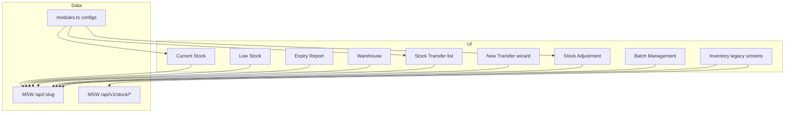

# Stock Management Module

Documentation for the **Stock Management** area of the RouteSale Web Portal — warehouse inventory levels, transfers, adjustments, batch tracking, low-stock alerts, and expiry reporting.

---

## 1. Overview

Stock Management supports **warehouse and depot inventory** for FMCG / distribution. Staff monitor on-hand quantities by location, move stock between warehouses, correct variances, track batches and expiry, and act on reorder alerts.

**Demo warehouses:** Main Warehouse, Cold Storage, Depot North, Depot South (plus extra seeded names on the warehouse master).

| Capability | Description |
|------------|-------------|
| **Visibility** | Current stock by SKU / warehouse with KPIs and warehouse distribution |
| **Movement** | Inter-warehouse stock transfer (create wizard + list) |
| **Correction** | Manual adjustments (addition, removal, damage, return, correction) |
| **Alerts** | Low stock and out-of-stock monitoring vs reorder level |
| **Batch & expiry** | Batch master + expiry report (shop owner vs warehouse views) |
| **Locations** | Warehouse master with list + product stock tab |

Related product master data (catalog, categories, brands) lives under the separate **Inventory** sidebar section. Older inventory stock screens still exist as **legacy** paths under `/inventory/...`.

---

## 2. Architecture (important)

The module uses a **hybrid** setup:

1. **Standalone custom pages** — richer UI under `src/pages/stock/` for Current Stock, Low Stock, Expiry Report, and Warehouse.
2. **Config-driven modules** — AG Grid / charts / CRUD via `ModulePage` + `ModuleLayout` for Stock Transfer, Stock Adjustment, and Batch Management.
3. **Transfer wizard** — dedicated create flow at `/stock-management/stock-transfer/new`.
4. **Documented flow panels** — optional demo panels on legacy Inventory warehouse / allocation pages (`DocumentedFlowPanel`).

There is **no production backend** for stock today. List/CRUD data is served by **MSW** mock APIs (`/api/{module-slug}`). Flow demos use `/api/v1/stock/...`. Data is held in the in-memory MSW store (regenerated on refresh unless the session keeps the mock store).

### Stock Management vs Inventory (legacy)

| Area | Paths | Notes |
|------|-------|-------|
| **Stock Management** (primary) | `/stock-management/*` | Sidebar “Stock Management”; preferred UX |
| **Inventory** (catalog + legacy stock) | `/inventory/*` | Products / categories / brands; older stock screens labeled “Legacy” in More menu |



---

## 3. Sidebar & URL paths

### Visible in sidebar (Stock Management)

| Menu label | Path | Page type |
|------------|------|-----------|
| Current Stock | `/stock-management/current-stock` | Standalone |
| Stock Transfer | `/stock-management/stock-transfer` | Module + wizard |
| Stock Adjustment | `/stock-management/stock-adjustment` | Module |
| Low Stock | `/stock-management/low-stock` | Standalone |
| Batch Management | `/stock-management/batch-management` | Module |
| Expiry Report | `/stock-management/expiry-report` | Standalone |
| Warehouse | `/stock-management/warehouse` | Standalone |

### Other reachable routes

| Screen | Path | Notes |
|--------|------|-------|
| New Stock Transfer | `/stock-management/stock-transfer/new` | Create wizard (`CreateStockTransferPage`) |

### Related Inventory (not under Stock Management sidebar)

| Screen | Path | Notes |
|--------|------|-------|
| Product Catalog | `/inventory/product-catalog` | Product master |
| Categories / Brands | `/inventory/categories`, `/inventory/brands` | Masters |
| Stock Allocation | `/inventory/stock-allocation` | Batch allocate + flow panel |
| Warehouses (legacy) | `/inventory/warehouse` | Includes `WarehouseTransferPanel` |
| Stock Transfer / Low Stock / Batch / Expiry (legacy) | `/inventory/stock-transfer` etc. | Older module screens |
| Stock Movement | `/inventory/stock-movement` | Movement history module |
| Units | `/inventory/units` | UOM master |

**Quick action:** “Assign Stock” → `/inventory/stock-allocation`.

---

## 4. Pages & features

### 4.1 Current Stock — `/stock-management/current-stock`

**File:** `src/pages/stock/CurrentStockPage.tsx`  
**Config slug:** `stock-management-current-stock`

- KPI cards: total products, total units, low-stock count, stock value.
- Filters: search, status (`active` / `low_stock` / `overdue`), date range, **warehouse**.
- AG Grid of SKU × warehouse with reorder level and unit price.
- Side analytics: warehouse distribution + low-stock alert list (scrollable).
- View / delete row actions; export Excel / PDF / print.
- Shortcut to Low Stock page.

**Statuses**

| Status | Meaning |
|--------|---------|
| `active` | On-hand ≥ reorder level |
| `low_stock` | On-hand &lt; reorder level |
| `overdue` | Used as **out of stock** (qty = 0) in generators |

### 4.2 Stock Transfer — `/stock-management/stock-transfer`

**Config slug:** `stock-management-stock-transfer`  
**Documented flow:** `stock-transfer` → **New Transfer** opens the wizard.

**List columns:** Transfer ID, date, source / destination warehouse, product count, total qty, requested/approved by, status.

**Statuses:** `pending` → `approved` → `in_transit` → `completed` (also `cancelled`).

#### New Transfer wizard — `/stock-management/stock-transfer/new`

**File:** `src/components/flows/CreateStockTransferPage.tsx`

1. Choose source and destination warehouse (must differ).
2. Set date, requested by, notes.
3. Search/select products (from flow `/api/v1/products`).
4. Set quantity per line (capped by available `stockQty`).
5. Submit → `POST /api/stock-management-stock-transfer` with `status: 'pending'`.
6. Returns to transfer list; query cache for that module is invalidated.

### 4.3 Stock Adjustment — `/stock-management/stock-adjustment`

**Config slug:** `stock-management-stock-adjustment`  
**Layout:** transaction-style module (form dialog for add).

**Adjustment types:** Addition (Stock In), Removal (Stock Out), Correction, Damage / Loss, Return.

**Reasons:** Physical Count, Damaged Goods, Theft / Loss, Supplier Return, System Error, Other.

**Statuses:** `pending`, `approved`, `completed`, `cancelled`.

Codes look like `ADJ-00001`. Demo data does **not** automatically update Current Stock quantities when an adjustment is saved (mock CRUD only).

### 4.4 Low Stock — `/stock-management/low-stock`

**File:** `src/pages/stock/LowStockPage.tsx`  
**Config slug:** `stock-management-low-stock`

- KPIs for total / low / out-of-stock / units.
- Critical items panel (worst stock-vs-reorder ratio).
- Warehouse risk breakdown and category chart.
- Grid filtered conceptually for items below reorder; statuses `low_stock` and `overdue` (out of stock).

### 4.5 Batch Management — `/stock-management/batch-management`

**Config slug:** `stock-management-batch-management`  
**Layout:** generic module (with batch-specific handling in `ModuleLayout`).

- Track batch number, warehouse, qty, manufacturing date, expiry, status.
- Create / edit / delete via module form dialog.
- Codes / batches seeded as `B####` style in mock product records.

### 4.6 Expiry Report — `/stock-management/expiry-report`

**File:** `src/pages/stock/ExpiryReportPage.tsx`  
**Config slug:** `stock-management-expiry-report`

Two **role-style views** (tabs):

| Tab | Focus column | Filter |
|-----|--------------|--------|
| Shop Owner | `shop` | `view = shop_owner` |
| Admin Warehouse | `warehouse` | `view = admin_warehouse` |

**Expiry status mapping (demo generator)**

| Status | Meaning |
|--------|---------|
| `overdue` | Already expired |
| `low_stock` | Expiring within ≤ 7 days |
| `pending` | Expiring within ≤ 30 days |
| `active` | Safe (&gt; 30 days) |

KPIs: total products, expired, expiring ≤ 7 days, expiring ≤ 30 days. Supports export / print / view / delete.

### 4.7 Warehouse — `/stock-management/warehouse`

**File:** `src/pages/stock/WarehousePage.tsx`  
**Config slug:** `stock-management-warehouse`

Tabs:

1. **Warehouse List** — CRUD for warehouse master (name, code, manager, phone, location, capacity). KPIs for warehouses / products / stock value / active.
2. **Warehouse Stock** — product stock grid powered by `stock-management-current-stock` config/data.

### 4.8 Legacy Inventory stock screens

Still reachable (often under More / advanced nav):

| Module | Path | Extra UI |
|--------|------|----------|
| Warehouses | `/inventory/warehouse` | `documentedFlow: 'stock-management'` + `warehouseTransfer` feature (`WarehouseTransferPanel` — UI demo only) |
| Stock Allocation | `/inventory/stock-allocation` | `StockAllocationPanel` + batch allocation form defaults |
| Stock Transfer / Adjustment / Movement / Low Stock / Batch / Expiry | `/inventory/...` | Generic modules |

`WarehouseStockTabs` can show product stock split by warehouse on compatible warehouse UIs.

---

## 5. Primary user workflows

### A. Monitor stock health

```
Current Stock → filter by warehouse / status
     ↓
Low Stock (from alert panel or sidebar) → review critical SKUs
     ↓
Stock Adjustment or Purchase / Transfer to replenish
```

### B. Inter-warehouse transfer

```
Stock Transfer → New Transfer
     → choose source & destination
     → add products + quantities
     → save (pending)
     → list shows TRF-##### records
```

### C. Batch & expiry control

```
Batch Management → maintain batch + expiry
     ↓
Expiry Report → Shop Owner or Admin Warehouse tab
     → act on expired / near-expiry lines
```

### D. Warehouse setup

```
Warehouse → Warehouse List → Add / Edit location
     ↓
Warehouse Stock tab → inspect SKUs at all locations
```

### E. Allocate to field agent (Inventory)

```
Inventory → Stock Allocation → Allocate Stock (flow panel)
     → mark received when delivered
```

---

## 6. Roles & permissions

Stock Management screens are **not** wrapped in `RoleGuard` today — any authenticated user can open them.

| Role | Typical use |
|------|-------------|
| `admin` / `manager` | Full stock ops, warehouses, approvals mindset |
| Warehouse staff | Current stock, transfer, adjustment, batch, expiry |
| Sales / field | Consume allocation / sales flows; expiry shop-owner view |

Demo logins (see `src/mocks/flowData.ts`):

| Mobile | Name | Role |
|--------|------|------|
| `9876543210` | Rahul Sharma | salesman |
| `9876543211` | Amit Delivery | deliveryAgent |
| `9876543212` | Priya Manager | manager |
| `9876543213` | Admin User | admin |

---

## 7. Data models (mock records)

Generated in `src/mocks/data/generators.ts`.

### Current stock — `currentStockRecord`

| Field | Description |
|-------|-------------|
| `code` | SKU (`PRD-#####`) |
| `name`, `category`, `brand`, `unit` | Product attrs |
| `warehouse` | Location name |
| `stock`, `minStock` | On-hand and reorder level |
| `mrp`, `amount` | Unit price and line value |
| `date` | Stock-as-of date (enables date filter) |
| `status` | `active` / `low_stock` / `overdue` |

### Stock transfer — `stockTransferRecord`

| Field | Description |
|-------|-------------|
| `code` | `TRF-#####` |
| `sourceWarehouse`, `destinationWarehouse` | Endpoints |
| `productCount`, `totalQuantity` | Summary |
| `requestedBy`, `approvedBy`, `notes` | Audit |
| `status` | Transfer lifecycle |

Wizard POST also stores line items under `products[]` on create.

### Stock adjustment — `stockAdjustmentRecord`

| Field | Description |
|-------|-------------|
| `code` | `ADJ-#####` |
| `adjustmentType`, `quantity`, `reason` | Correction details |
| `warehouse`, `name`, `adjustedBy`, `date` | Context |
| `status` | Approval lifecycle |

### Low stock — `lowStockRecord`

Same shape as current stock alerts: `stock` always below `minStock` (or zero → `overdue`).

### Expiry — `expiryRecord`

| Field | Description |
|-------|-------------|
| `batch`, `batchDate`, `expiry`, `daysRemaining` | Batch timeline |
| `batchStockCount` | Qty on batch |
| `shop` / `warehouse` | View-specific location |
| `view` | `shop_owner` \| `admin_warehouse` |
| `status` | Expired / near-expiry / safe |

### Warehouse — `warehouseRecord`

| Field | Description |
|-------|-------------|
| `code` | `WH-###` |
| `name`, `manager`, `phone`, `location` | Master data |
| `stockRooms`, `stock`, `amount`, `capacity` | Capacity / value summary |
| `status` | Usually `active` |

### Seed warehouse names (stock lines)

`Main Warehouse`, `Cold Storage`, `Depot North`, `Depot South`

---

## 8. Business rules

### Current stock

- Status derived from qty vs `minStock` (and zero → out of stock / `overdue` in demos).
- Warehouse filter is a **query param** (`warehouse`) on the list API.
- Analytics widgets load up to 500 rows separately from the paged grid.

### Stock transfer

- Source and destination must be different warehouses (validated in the wizard UI).
- Line qty clamped to `1 … product.stockQty`.
- New transfers start as `pending`.
- List statuses include in-transit and completed for demo reporting.

### Stock adjustment

- Types cover in / out / correction / damage / return.
- Saving creates a module record only; **does not** cascade into current-stock quantities in the mock layer.

### Low stock

- Demo generator always produces below-reorder or zero qty.
- Critical list ranks by `stock / minStock` ascending.

### Expiry

- Records alternate `view` for shop vs warehouse tabs.
- Status encodes urgency bands (expired / ≤7 / ≤30 / safe).

### Warehouse transfer panel (legacy Inventory)

- `WarehouseTransferPanel` is a **client-side demo** (success message only; no API write).

### Stock allocation (Inventory)

- Flow API creates allocations and can mark `received` via PATCH delivery endpoint.

---

## 9. APIs & services

### Generic module CRUD

Base client: `src/api/client.ts` → `GET/POST/PUT/DELETE /api/{slug}`

| Slug | Used by |
|------|---------|
| `stock-management-current-stock` | Current Stock, Warehouse Stock tab |
| `stock-management-stock-transfer` | Transfer list + create |
| `stock-management-stock-adjustment` | Adjustment module |
| `stock-management-low-stock` | Low Stock |
| `stock-management-batch-management` | Batch Management |
| `stock-management-expiry-report` | Expiry Report (`view` filter) |
| `stock-management-warehouse` | Warehouse list |

List filters relevant to stock: `search`, `status`, `dateFrom`, `dateTo`, `warehouse`, `view`.

Handlers: `src/mocks/handlers.ts` (in-memory store per slug).  
Record factories: `src/mocks/data/generators.ts`.

### Flow API (`/api/v1/...`) — documented panels & transfer products

| Method | Endpoint | Purpose |
|--------|----------|---------|
| GET | `/api/v1/products` | Products for transfer wizard |
| GET/POST | `/api/v1/stock/allocations` | Stock allocation list / create |
| PATCH | `/api/v1/stock/allocations/:id/delivery` | Mark allocation received |
| GET | `/api/v1/stock/overview` | SKU / value / low-stock / movements summary |
| POST | `/api/v1/stock/movements` | Record stock in/out movement |

Implemented in `src/mocks/flowHandlers.ts`; called via `src/api/flowClient.ts`.

---

## 10. Source file map

### Pages — `src/pages/stock/`

| File | Role |
|------|------|
| `CurrentStockPage.tsx` | Current stock dashboard + grid |
| `LowStockPage.tsx` | Low-stock alerts + analytics |
| `ExpiryReportPage.tsx` | Expiry report with shop/warehouse tabs |
| `WarehousePage.tsx` | Warehouse list + warehouse stock tabs |

### Flows & panels

| File | Role |
|------|------|
| `src/components/flows/CreateStockTransferPage.tsx` | New transfer wizard |
| `src/components/flows/DocumentedFlowPanel.tsx` | `StockAllocationPanel`, `StockManagementPanel` |
| `src/components/module/WarehouseTransferPanel.tsx` | Legacy room-to-room transfer demo |
| `src/components/module/WarehouseStockTabs.tsx` | Stock split by warehouse tabs |

### Routing & config

| File | Role |
|------|------|
| `src/routes/index.tsx` | Standalone routes + transfer `/new` |
| `src/routes/navigation.ts` | Sidebar Stock Management + Inventory legacy |
| `src/config/modules.ts` | Module configs / columns / forms / stats |
| `src/config/quickActions.ts` | Assign Stock → allocation |
| `src/pages/layouts/ModuleLayout.tsx` | Generic module shell; transfer CTA; batch/warehouse flags |
| `src/hooks/useModuleData.ts` | List / CRUD React Query hook |
| `src/types/module.ts` | `DocumentedFlow`, `ModuleFeature` (`warehouseTransfer`, `stockBatchAllocation`) |

### Mocks

| File | Role |
|------|------|
| `src/mocks/handlers.ts` | Module CRUD + filters |
| `src/mocks/data/generators.ts` | Stock record generators |
| `src/mocks/flowHandlers.ts` | `/api/v1/stock/*` and products |

---

## 11. Integrations

| Area | How it connects |
|------|-----------------|
| **Inventory** | Product catalog / brands / categories; legacy stock screens |
| **Purchase** | Replenishment mindset (POs feed stock in a real system) |
| **Sales / Returns** | Sales return wizard notes stock/accounting impact in product docs |
| **Reports** | Inventory Report under `/reports/inventory-report` |
| **Dashboard** | Notifications can include low-stock alerts; business overview warehouse stock |
| **Accounting** | Stock value appears in KPIs; P&amp;L / balance sheet are separate modules |
| **Logistics** | Transfers conceptually move stock between depots |

---

## 12. Module config registry keys

Path → slug mapping follows `stock-management-{segment}` (see `getModuleConfig` in `modules.ts`):

| Path | Registry key |
|------|----------------|
| `/stock-management/current-stock` | `stock-management-current-stock` |
| `/stock-management/stock-transfer` | `stock-management-stock-transfer` |
| `/stock-management/stock-adjustment` | `stock-management-stock-adjustment` |
| `/stock-management/low-stock` | `stock-management-low-stock` |
| `/stock-management/batch-management` | `stock-management-batch-management` |
| `/stock-management/expiry-report` | `stock-management-expiry-report` |
| `/stock-management/warehouse` | `stock-management-warehouse` |

Standalone pages **override** the generic `ModulePage` for current-stock, low-stock, expiry-report, and warehouse in `src/routes/index.tsx`.

---

## 13. Developer notes

1. Prefer **`/stock-management/*`** for new stock UX; treat `/inventory/*` stock screens as legacy unless working on catalog/allocation.
2. Standalone stock pages still read column/stat definitions from `modules.ts` via `getModuleConfig(path)`.
3. Creating transfers/adjustments in MSW does **not** recalculate current-stock rows — wire that when a real API exists.
4. Expiry `view` filter and Current Stock `warehouse` filter are first-class list params in mock handlers — keep them if you replace MSW.
5. Production would replace MSW with REST while keeping the same routes and page flows.
6. Related product docs: root `README.md` (§ Inventory) and `DEVELOPER.md` (module layout features).

---

## 14. Quick reference — who does what

| Actor | Main screens |
|-------|--------------|
| Warehouse manager | Current Stock, Warehouse, Transfer, Adjustment, Expiry (Admin) |
| Store / shop owner | Expiry Report (Shop Owner tab) |
| Ops / admin | Batch Management, Low Stock, Allocation (Inventory) |
| Developer | `modules.ts` + `src/pages/stock/*` + MSW generators/handlers |
